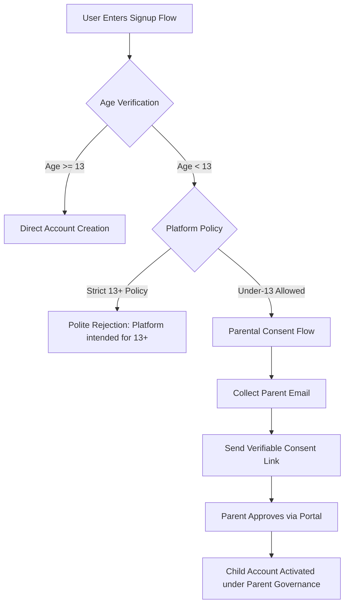

# Student & Minor Safety Review — Xpedition Platform
**Phase E Governance Audit Document**  
**Date:** September 17, 2026  
**Product:** Xpedition  
**Document Status:** Pre-Launch Safety & Legal Analysis

---

## 1. Executive Summary

Xpedition is an interactive, gamified adaptive learning platform designed around the educational principle: *"Learn by Doing. Not by Watching."* The learning platform covers STEM subjects including classical physics, biology, chemistry, mathematics, and computer science.

Because educational software frequently serves minors (students under 18) and younger children (under 13 in the United States, or under 13–16 in the EU/UK), this document audits the repository's current technical behaviors, identifies missing policy and consent mechanisms, outlines recommended legal review points, and provides technical implementation pathways.

> [!IMPORTANT]
> **No Regulatory Compliance Falsely Claimed:**  
> Xpedition does not currently assert formal regulatory certification under COPPA (Children's Online Privacy Protection Act), GDPR-K (General Data Protection Regulation — Children's Provisions), or FERPA (Family Educational Rights and Privacy Act). Formal compliance requires specific legal counsel, established age boundaries, and verifiable parental/institutional consent workflows.

---

## 2. Current Repository Technical State

A comprehensive code audit reveals the following technical properties:

### 2.1 Absence of Commercial Ad Tracking
- **Zero Third-Party Advertising Trackers:** The repository contains zero advertising SDKs, pixel trackers (e.g., Facebook Pixel, Google AdSense, TikTok Pixel), or commercial data-broker integrations.
- **No Behavioral Profiling for Advertising:** Telemetry events (`lib/experience/telemetry/`) record only educational interaction metrics (e.g., parameter slider changes, trajectory simulations, BKT mastery probability updates, response times).
- **No Data Monetization:** User data is not sold or shared with commercial marketing entities.

### 2.2 Onboarding & Age Collection State
- **Current Onboarding Fields (`lib/onboarding.ts`):** Collects display name (handle), target subject/goal, preferred language (English, Tanglish, Tamil), daily commitment minutes (15, 30, 45, 60), starting difficulty level, and avatar.
- **Missing Age Gate:** The repository does **not** currently ask for the user's date of birth or age during signup or onboarding.
- **Current Default Audience Assumption:** The platform currently operates as a general-audience educational platform with self-study capabilities.

### 2.3 Single-Player Educational Environment
- **No Unmoderated Social Communication:** There are no open public chat rooms, direct student-to-student messaging systems, or public message boards where minors could be contacted by unknown third parties.
- **Interaction Model:** The interaction model is strictly single-learner interaction with the deterministic simulation engine and the Xira pedagogical advisor.
- **Passport Sharing:** Skill passports (`/passport/[id]`) generate read-only concept mastery summaries. No personal contact details (email, phone, address) are exposed on the public passport view.

### 2.4 AI Interaction Safeguards
- **Xira Pedagogical Guardrails:** Prompt engineering instructions (`lib/intelligence/prompts.ts`) strictly constrain Xira to educational tutoring, encouraging inquiry, hints, and concept reinforcement.
- **Zero AI Evaluation Authority:** AI does not make punitive or final assessment decisions; Bayesian Knowledge Tracing deterministically assesses mastery based on validated student interactions.
- **Prompt Injection Boundaries:** User inputs submitted during educational queries are sanitized and delimited to prevent subversion of instructional guardrails.

---

## 3. Missing Policy Decisions (Action Required by Founders)

Before general public distribution, founders and legal counsel must resolve the following key policy choices:

| Decision Point | Current Implementation | Founder/Legal Decision Needed |
| :--- | :--- | :--- |
| **Minimum Age Threshold** | None collected | Choose whether Xpedition is strictly for users aged **13 and older** (standard terms threshold), or supports **under-13 learners** with parental consent. |
| **Age Gate at Signup** | No birthdate requested | If restricting to 13+, implement an age-neutral birthdate check or age confirmation checkbox during registration. |
| **Verifiable Parental Consent (VPC)** | Not implemented | If admitting under-13 users under COPPA, implement a compliant VPC mechanism (e.g., credit card transaction, email plus verification, or consent portal). |
| **School / District Contracts** | Direct-to-consumer only | If deploying into K-12 schools, establish School Official contracts compliant with FERPA, SOPPA (Illinois), and California AB 1584. |

---

## 4. Recommended Legal Review Points

Legal counsel reviewing Xpedition prior to launch should evaluate:

1. **COPPA (15 U.S.C. §§ 6501–6506) Applicability:**  
   Determine whether Xpedition's visual theme (sci-fi, space explorer, cosmic worlds) could be deemed "directed to children under 13" under FTC factors (visual style, character avatars, subject matter). If deemed directed to children, COPPA requirements apply regardless of terms.
2. **GDPR Article 8 & UK Age Appropriate Design Code (AADC):**  
   For European and UK users, evaluate standards for default high privacy settings, profiling restrictions, and lawful processing basis for users aged 13–16.
3. **Third-Party AI Processor Terms for Minors:**  
   Review Terms of Service and data processing agreements with configured AI providers (Groq, OpenAI, Google) regarding the submission of minor student prompts to their APIs.
4. **Educational Disclaimers:**  
   Ensure educational disclaimers clearly state that Xpedition is a supplementary learning tool and not an accredited school or formal diploma-granting institution.

---

## 5. Technical Implementation Roadmap for Minor Safety

When founders decide to implement age gating or parental consent:

### Key Technical Safeguards to Implement:
1. **Age Confirmation Field:** Add an age verification question to `/login?mode=signup`.
2. **Parent Account Linking:** Provide parent dashboard capability where parents can inspect, export, or delete their child's educational records.
3. **Session Auto-Timeout:** Standard inactivity timeouts for minor sessions.
4. **Content Filtering:** Maintain strict safety filters on all user-submitted syllabus PDFs and notes to prevent ingestion of inappropriate materials.

---

## 6. Document Conclusion

Xpedition's foundational architecture exhibits high privacy hygiene: it has zero commercial advertising trackers, practices data minimization, isolates user data with Row Level Security, and keeps all AI assessment strictly advisory. To achieve full regulatory compliance for minor students, founders must establish an authoritative age policy and implement age verification prior to public marketing to K-12 audiences.
